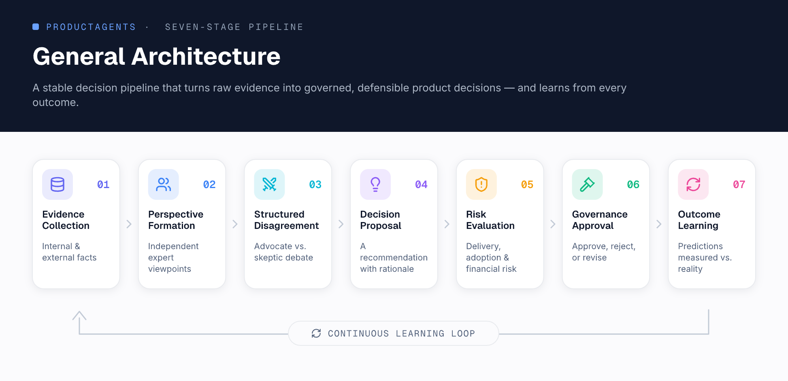
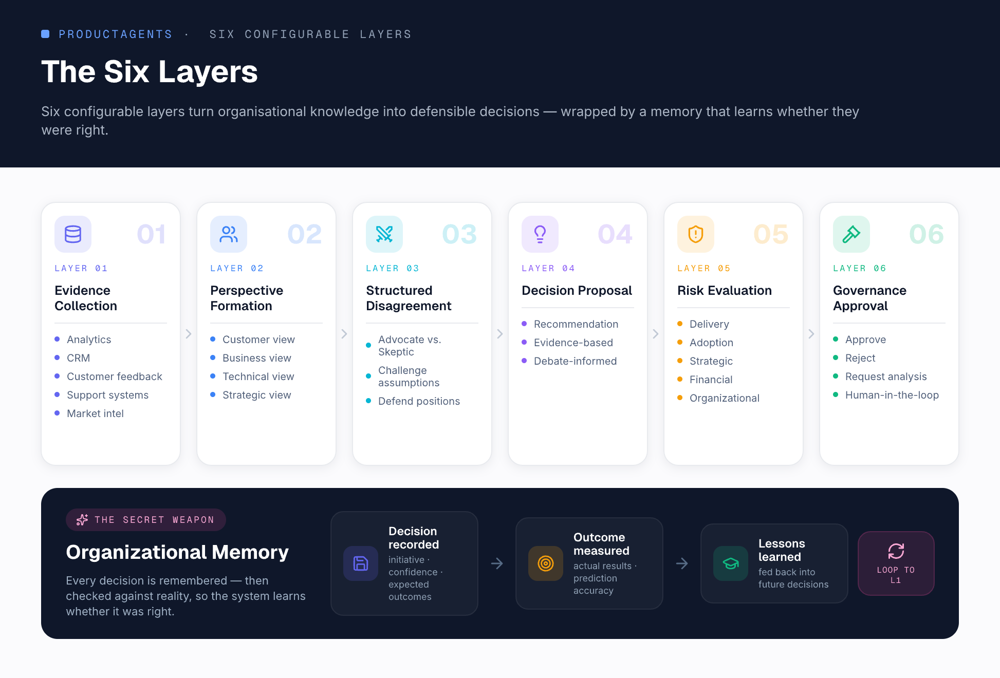
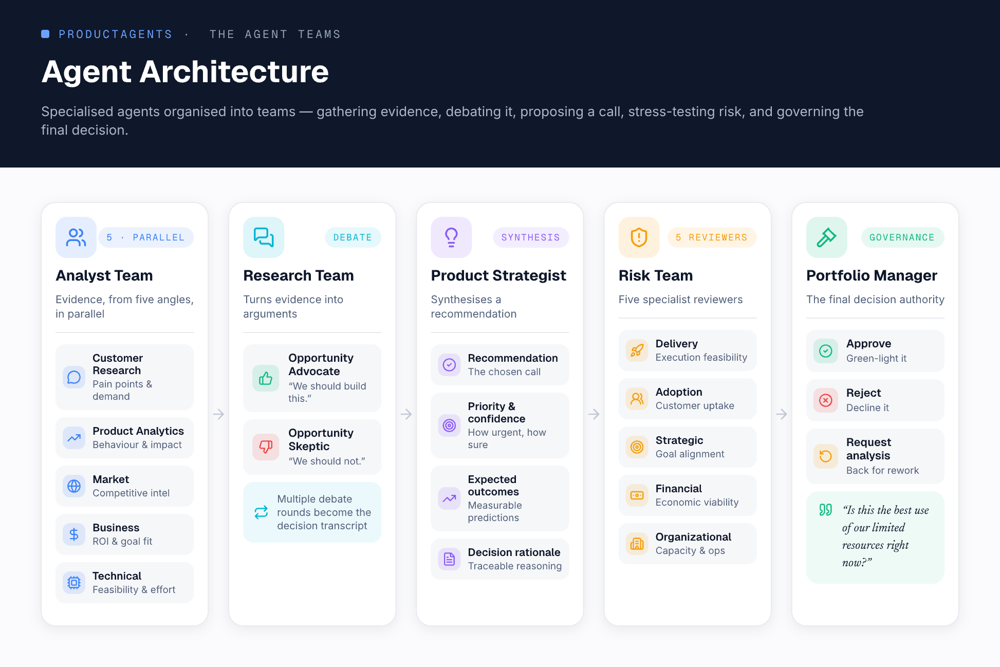

# ProductAgents

> ProductAgents is a multi-agent framework for product decision-making under uncertainty.

Inspired by organizational decision-making and multi-agent architectures, ProductAgents models how high-performing product organizations evaluate opportunities, challenge assumptions, manage risk, and make strategic decisions.

> The goal is not to build a smarter AI. The goal is to build a smarter decision-making process.

Real organizations don't rely on a single person to decide what to build next. Product decisions emerge from the interaction of customer insights, business constraints, technical realities, market signals, strategic goals, and healthy disagreement between experts. ProductAgents brings those dynamics into a transparent, traceable, and configurable system that turns organizational knowledge into defensible product decisions.

Every recommendation is **evidence-based, fully traceable, open to challenge, risk-assessed, governed through explicit approval, and continuously improved through learning.**

📜 See the **[CHANGELOG](CHANGELOG.md)** for the V1 → V2 timeline.

---

## Core Principles

- **Specialization** — Customer insights, business metrics, technical constraints, and market dynamics each provide different signals; they shouldn't be collapsed into a single summary too early.
- **Structured Disagreement** — Healthy organizations challenge their own assumptions. ProductAgents explicitly creates opposing viewpoints and debate loops before deciding.
- **Transparency** — Every decision is explainable. The framework preserves analyst reports, debate transcripts, risk assessments, approval decisions, and outcome reviews.
- **Learning** — Every decision creates data. The system reflects on past recommendations and uses those lessons to improve future ones.

---

## General Architecture

ProductAgents follows a seven-stage pipeline that turns raw evidence into governed, defensible decisions and learns from every outcome. The architecture stays stable while agents, integrations, and workflows are customized per company.

<p align="center">
  
</p>

Equivalently, the system is organized into **six configurable layers**, wrapped by an organizational memory that learns whether each decision was right:

1. **Evidence Collection** — gather facts from internal/external systems (analytics, CRM, feedback, support, market intelligence).
2. **Perspective Formation** — generate independent viewpoints (customer, business, technical, strategic) from the evidence.
3. **Structured Disagreement** — opposing agents challenge assumptions and defend positions through debate.
4. **Decision Proposal** — produce a recommendation from evidence and debate outcomes.
5. **Risk Evaluation** — assess delivery, adoption, strategic, financial, and organizational risks.
6. **Governance Approval** — approve, reject, or request additional analysis.

<p align="center">
  
</p>

---

## Agent Architecture

Specialized agents are organized into teams that gather evidence, debate it, propose a call, stress-test risk, and govern the final decision.

<p align="center">
  
</p>

### Analyst Team (runs in parallel)

| Analyst | Analyzes | Produces |
|---|---|---|
| **Customer Research** | Interviews, support tickets, feedback, NPS | Pain points, demand signals, evidence summaries |
| **Product Analytics** | Usage, funnels, retention, adoption | Behavioral insights, impact estimates, opportunity sizing |
| **Market** | Competitors, trends, launches, market shifts | Competitive intel, market opportunities, strategic context |
| **Business** | Revenue, costs, company goals, initiatives | Business impact, goal alignment, ROI considerations |
| **Technical** | Architecture, tech debt, dependencies, complexity | Feasibility, technical risks, effort estimates |

### Research Team

Transforms evidence into arguments through multiple rounds of structured debate; the transcript becomes part of the decision record.

- **Opportunity Advocate** — argues *we should build this*, focusing on customer value, business impact, strategic opportunity, and competitive advantage.
- **Opportunity Skeptic** — argues *we should not build this*, focusing on opportunity cost, risk, complexity, and uncertainty.

### Product Strategist

Consumes analyst reports, debate transcripts, and organizational context to produce a recommendation, priority assessment, confidence score, expected outcomes, and decision rationale.

### Risk Team

Before approval, recommendations pass through five specialized reviewers: **Delivery** (execution feasibility), **Adoption** (customer adoption), **Strategic** (goal alignment), **Financial** (economic viability and return), and **Organizational** (capacity and operational constraints).

### Product Portfolio Manager

The final decision authority. It reviews recommendations, weighs portfolio trade-offs, and approves or rejects initiatives. It doesn't ask *"Is this a good idea?"* but rather *"Is this the best use of our limited resources right now?"*

---

## The Secret Weapon: Organizational Memory

Every completed decision becomes part of the organization's collective learning system. Decision records capture the recommendation; later, the framework evaluates how it actually turned out:

```json
// decision
{ "initiative": "...", "recommendation": "...", "confidence": 0.0, "reasoning": "...", "expected_outcomes": [] }
// outcome
{ "actual_outcomes": [], "prediction_accuracy": 0.0, "lessons_learned": [] }
```

This creates a continuous feedback loop. The goal is not simply to remember decisions — it's to remember **whether those decisions were correct**, and apply those lessons to new choices.

---

## Design Goals

Framework-first and organization-agnostic by default · configurable agent ecosystem · transparent reasoning · human-in-the-loop governance · durable decision history · production-ready orchestration · extensible integrations.

## Technology Stack

- **Runtime:** Python 3.14, [uv](https://docs.astral.sh/uv/) workspace (seven member packages)
- **Orchestration:** LangGraph (checkpointed graph execution)
- **Models:** provider-agnostic (OpenAI, Anthropic, Google Gemini, OpenRouter, local models)
- **Structured outputs:** strongly typed Pydantic schemas for critical decisions
- **Persistence:** SQLite → Postgres via SQLAlchemy/SQLModel with Alembic migrations; a canonical record store is the system of record (JSONL is export/audit only)
- **Connectors:** httpx-based sync from external systems (GitHub, Jira) into the canonical store
- **Organizational memory:** DB-backed decision/outcome store with hybrid (lexical + semantic) lesson retrieval
- **Observability:** structured span-style logs for decision runs and connector syncs

## Future Roadmap

Roadmap prioritization · opportunity assessment · product strategy reviews · quarterly planning · feature investment decisions · build vs. buy analysis · product portfolio management · go-to-market readiness reviews.

---

## Download & install the desktop app

Grab the installer for your platform from the
[latest release](https://github.com/mcapanema/ProductAgents/releases/latest).
No Python, uv, or Node is required — the backend is bundled.

Builds are currently **unsigned**, so the OS will warn on first launch:

- **macOS** (`.dmg`): drag to Applications, then right-click the app →
  **Open** → **Open** (once). If it still refuses, run
  `xattr -d com.apple.quarantine "/Applications/ProductAgents.app"`.
  The arm64 `.dmg` is for Apple Silicon; the Intel `.dmg` for older Macs.
- **Windows** (`.msi`/`.exe`): on the SmartScreen prompt choose
  **More info → Run anyway**.
- **Linux** (`.AppImage`): `chmod +x ProductAgents_*.AppImage && ./ProductAgents_*.AppImage`,
  or install the `.deb`.

The app updates itself: **Settings → Check for updates** downloads and installs
new releases (verified against a built-in signing key). On macOS the same
first-launch unsigned-app step may reappear after a major update.

---

## Getting Started

ProductAgents runs the **full advisory pipeline on a real data platform**. Five analysts evaluate evidence in parallel, an Advocate and a Skeptic debate the initiative, a strategist produces a recommendation, an LLM-as-Judge quality gate scores it (looping back for revision if it doesn't pass), a five-reviewer Risk Team assesses it, and a Portfolio Manager produces an advisory verdict — then a human makes the binding call (approve / reject / request analysis) in the desktop app (or auto-approves in a headless CLI run). Connectors sync external systems (today: GitHub issues and Jira) into a canonical store the agents read from; every run is persisted — full transcript, judge verdict, risk assessments, human decision, and evidence provenance — to the DB-backed organizational memory (`DecisionStore`), which is the system of record. What remains on the road to the full vision above is **breadth** — more evidence connectors and the planned layers — not the core loop.

### Setup

```bash
uv sync
```

### Configure a model

Model selection is provider-agnostic (defaults to `anthropic:claude-sonnet-4-6`). The easiest way is to copy the template — `.env` is loaded automatically on startup and is git-ignored:

```bash
cp .env.example .env   # then edit .env and set your provider API key
```

Variables exported in your shell take precedence over `.env`. To use another provider, set both the model and provider:

```bash
export PRODUCTAGENTS_MODEL="gpt-5.5"
export PRODUCTAGENTS_MODEL_PROVIDER="openai"
export OPENAI_API_KEY="sk-..."
```

**OpenRouter free models** — [OpenRouter](https://openrouter.ai) exposes many models behind one key. Use an `openrouter:`-prefixed id (the prefix selects the provider, and a `:free` suffix is preserved):

```bash
export PRODUCTAGENTS_MODEL="openrouter:deepseek/deepseek-chat-v3-0324:free"
export OPENROUTER_API_KEY="sk-or-..."
```

> **Pick a model that supports tool/function calling.** Every stage uses structured output, so a model without tool support falls back to placeholder results rather than failing loudly. Known-good free options: `deepseek/deepseek-chat-v3-0324:free`, `meta-llama/llama-3.3-70b-instruct:free`, `google/gemini-2.0-flash-exp:free`. Expect free-tier rate limits.
>
> Free OpenRouter models are rate-limited and frequently return transient "Provider returned error" responses under load. `PRODUCTAGENTS_MAX_RETRIES` (default 6) retries these with backoff; if a model hits a hard daily cap, switch to a keyed/paid model.

### Tuning (optional)

```bash
export PRODUCTAGENTS_DEBATE_ROUNDS=2     # each round = one advocate argument + one skeptic rebuttal
export PRODUCTAGENTS_JUDGE_THRESHOLD=0.7 # min score (0-1) for evidence grounding & rationale coherence
export PRODUCTAGENTS_JUDGE_MAX_RETRIES=1 # times the judge can loop back to the strategist; 0 = score-only
export PRODUCTAGENTS_MAX_RETRIES=6      # retry budget (with backoff) for transient provider errors
```

### Connecting data sources

ProductAgents syncs external systems into its local canonical store *before* a
decision runs (no network calls happen during agent execution). Connectors are
configured in a YAML file — `connectors.yaml` by default, or the path in
`PRODUCTAGENTS_CONNECTORS_FILE`. Copy `connectors.yaml.example` to start:

```yaml
connectors:
  github:
    enabled: true
    owner: your-org
    repo: your-repo
    token_env: GITHUB_TOKEN   # token read from $GITHUB_TOKEN, never inlined
  jira:
    enabled: true
    base_url: https://your-site.atlassian.net
    email: you@your-org.com
    token_env: JIRA_API_TOKEN  # Jira API token read from $JIRA_API_TOKEN
    project: PROJ              # optional: limit to one project key
```

Each connector block is validated against that connector's typed schema at
startup; a missing referenced env var or an unknown connector is reported at
startup (fail-fast) rather than at sync time. The desktop app's **Connectors**
panel lets you run a sync or check health; per-connector cursors are persisted
so each run only pulls records changed since the last sync.

You can also sync headlessly: `uv run productagents sync` runs a one-shot
headless sync (for cron/launchd; it exits non-zero on failure), and setting
`PRODUCTAGENTS_SYNC_INTERVAL` makes a long-running process auto-sync on a timer.

### Run

Launch the desktop GUI with `make gui` (or `cd desktop && npm run tauri dev`), or run headlessly via the CLI:

```bash
uv run productagents run evaluate_initiative "Add enterprise SSO"
```

The CLI streams events to stdout as the pipeline runs; the desktop GUI shows live panels. Each run appends a record to the organizational-memory DB.

**Evidence is pluggable.** Use `--evidence <name-or-path>` with the CLI, or the evidence picker in the desktop Run panel. Each piece of evidence records its provenance, shown in the desktop app and saved on the decision record. The default is the bundled `sample` scenario.

**Outcome learning.** After a decision, record what actually happened with `productagents reflect` (lists past decisions; `productagents reflect DECISION_ID "note"` runs the reflection agent) or via the desktop **Reflection** panel (`reflection.record` IPC method). An Outcome Reflection Analyst compares predicted outcomes against reality and saves a prediction-accuracy score plus lessons to the DB (`DecisionStore`). Those reflections are automatically retrieved by hybrid (lexical + semantic) similarity and injected into the strategist's prompt on future decisions, closing the organizational-memory loop.

### Desktop GUI (Tauri + React)

The V3 desktop app lives in `desktop/`. It is a presentation adapter only — it
spawns `productagents ipc` (the JSON-over-stdio Application-Layer adapter) as a
child process and talks to it across the process boundary. It never imports
LangGraph, connectors, or persistence.

**Prerequisites.** The desktop shell needs Node (≥ 18) and a Rust toolchain. On
macOS the Rust shell also needs the Xcode Command Line Tools (for the C linker);
the system WebKit webview is already present. On Linux you additionally need the
WebKitGTK/`libsoup` dev packages — see https://v2.tauri.app/start/prerequisites/.

```bash
# Rust toolchain (one time) — installs rustup + the stable toolchain
curl --proto '=https' --tlsv1.2 -sSf https://sh.rustup.rs | sh -s -- -y
source "$HOME/.cargo/env"          # or just open a new shell
rustc --version && cargo --version # verify

# macOS only, if `cc`/`clang` is missing:
xcode-select --install
```

```bash
cd desktop
npm install            # first time
npm run tauri dev      # build the Rust shell + open the window (spawns the sidecar)
npm test               # frontend unit tests (Vitest)
```

> The first `npm run tauri dev` compiles the whole Rust dependency tree — a few
> minutes, one time (cached afterward).

Panels: **Run** (start a workflow, watch events stream live), **Sessions**
(replay a past run's event timeline), **Decisions** (the Decision Explorer:
browse past decisions with predicted-vs-actual outcomes and lessons learned).

#### Browser-based testing (Playwright + WS bridge)

The native Tauri window can't be browser-automated (on macOS there's no WKWebView
WebDriver). For automated UI testing we run the **React frontend in a real
browser** instead. A dev-only WebSocket bridge exposes the *same* Application
Layer the sidecar does, so the in-browser app reaches live data:

```bash
# 1. dev WebSocket bridge — same IPC methods as `productagents ipc`, on localhost
uv run productagents serve-ws            # ws://127.0.0.1:7420 (Ctrl+C to stop)

# 2. Playwright e2e — starts Vite + the bridge automatically, drives headless Chromium
cd desktop
npx playwright install chromium          # first time
npm run e2e                              # runs e2e/*.spec.ts
```

`npm run e2e` is self-contained: its `webServer` config launches both `npm run
dev` (the frontend) and `productagents serve-ws` (the bridge) before the specs.
When *not* inside Tauri, the frontend's transport (`createClient`) automatically
falls back from the Tauri sidecar to `ws://127.0.0.1:7420`. The bridge is a
**development affordance only** — localhost-bound and never bundled into the
shipped app; it is not a client/server product surface.

### Packaging

The desktop app ships as a single installable: the Python backend is frozen with
PyInstaller into a self-contained binary and bundled inside the Tauri app as an
`externalBin` sidecar, so the target machine needs no Python or uv.

```bash
make package          # build-sidecar + `tauri build` → installer under desktop/src-tauri/target/release/bundle/
make build-sidecar    # just freeze the sidecar binary
```

The sidecar is the existing `productagents ipc` server (`_sidecar_main.py` entry).
In development the Tauri shell still spawns `uv run productagents ipc`; in a
packaged build it runs the bundled binary and kills it on quit. Builds are
host-platform only for now (the build host's OS/arch); a cross-platform CI matrix
is a follow-up. Keep `tauri.conf.json` `version` in sync with `pyproject.toml`
(a test enforces it).

### Test

```bash
uv run pytest   # runs fully offline with a fake model — no API key required
```

---

## Why ProductAgents?

Because product management is not a prioritization framework — it is a decision-making system. Better decisions emerge when evidence, expertise, disagreement, governance, and learning work together. ProductAgents exists to make that process explicit, repeatable, and continuously improving.
</content>
